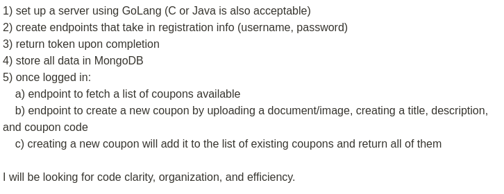

# Union Strategies Inc Takehome Challenge

This is a Rest API built with Golang, Gin, Mongodb, using jwt-token to authorize routes

## Clone the repository
  git clone [https://github.com/charleyvibez/uninc.git](https://github.com/charleyvibez/uninc.git)

## After cloning navigating to the directory

## Create a .env file, copy the content of example.env to the .env file
    cp example.env .env

## Install Dependencies

    go get ./...

## Run the app

    go run main.go

.

# REST API

The REST API to the example app is described below.

## Signup

### Request

`POST /users/signup`

     http://localhost:3000/users/signup

     {
       "username": "your username",
       "password": "your password"
     }

### Response

    HTTP/1.1 200 OK
    Date: Thu, 25 Nov 2021 12:36:30 GMT+1
    Status: 200 OK
    Connection: close
    Content-Type: application/json
    Content-Length: 2

    {
    "InsertedID": "619f71f6b529c5890c0bb467"
    }

## Login

### Request

`POST /users/login`

    http://localhost:3000/users/login

    {
       "username": "your username",
       "password": "your password"
    }

### Response

    HTTP/1.1 201 Created
    Date: Thu, 25 Nov 2021 12:36:30 GMT+1
    Status: 201 Created
    Connection: close
    Content-Type: application/json
    Location: /thing/1
    Content-Length: 36

    {
      "ID": "619f3d2509b5790471c4fc28",
      "username": "username",
      "Password": "hash_password",
      "token": "your token",
      "refresh_token": "refresh token",
      "created_at": "2021-11-25T07:37:09Z",
      "updated_at": "2021-11-25T10:50:58Z",
      "user_id": "619f3d2509b5790471c4fc28"
    }

## Create a coupon

### Request
`POST /create/coupon`

    http://localhost:3000/create/coupon

    token needs to be passed in the header
    token: "your token"

    {
      "Title": "Test coupon",
      "Description": "Testing out my create endpoint",
      "DocumentUrl": "https://testing.com",
      "CouponCode": "ever19"
    }

### Response

    HTTP/1.1 201 Created
    Date: Thu, 25 Nov 2021 12:36:30 GMT+1
    Status: 201 Created
    Connection: close
    Content-Type: application/json
    Location: /thing/1
    Content-Length: 36

    [
      {
          "ID": "619f5f187f1b8dae8c989737",
          "title": "Test coupon",
          "description": "Testing out my create endpoint",
          "documenturl": "https://testing.com",
          "couponcode": "ever12",
          "created_at": "2021-11-25T10:02:00Z",
          "updated_at": "2021-11-25T10:02:00Z",
          "coupon_id": "619f5f187f1b8dae8c989737"
      },
      {
          "ID": "619f66bc5eb0ab1d0c933b67",
          "title": "Test coupon",
          "description": "Testing out my create endpoint",
          "documenturl": "https://testing.com",
          "couponcode": "ever15",
          "created_at": "2021-11-25T10:34:36Z",
          "updated_at": "2021-11-25T10:34:36Z",
          "coupon_id": "619f66bc5eb0ab1d0c933b67"
      },
      {
          "ID": "619f66c8f135b2f8507cb29e",
          "title": "Test coupon",
          "description": "Testing out my create endpoint",
          "documenturl": "https://testing.com",
          "couponcode": "ever19",
          "created_at": "2021-11-25T10:34:48Z",
          "updated_at": "2021-11-25T10:34:48Z",
          "coupon_id": "619f66c8f135b2f8507cb29e"
      }
    ]

## List all coupon available

### Request
`GET /coupons`

    http://localhost:3000/coupons

    token needs to be passed in the header
    token: "your token"

### Response

    HTTP/1.1 200 OK
    Date: Thu, 25 Nov 2021 12:36:30 GMT+1
    Status: 200 OK
    Connection: close
    Content-Type: application/json
    Location: /thing/1
    Content-Length: 36

    [
      {
          "ID": "619f5f187f1b8dae8c989737",
          "title": "Test coupon",
          "description": "Testing out my create endpoint",
          "documenturl": "https://testing.com",
          "couponcode": "ever12",
          "created_at": "2021-11-25T10:02:00Z",
          "updated_at": "2021-11-25T10:02:00Z",
          "coupon_id": "619f5f187f1b8dae8c989737"
      },
      {
          "ID": "619f66bc5eb0ab1d0c933b67",
          "title": "Test coupon",
          "description": "Testing out my create endpoint",
          "documenturl": "https://testing.com",
          "couponcode": "ever15",
          "created_at": "2021-11-25T10:34:36Z",
          "updated_at": "2021-11-25T10:34:36Z",
          "coupon_id": "619f66bc5eb0ab1d0c933b67"
      },
      {
          "ID": "619f66c8f135b2f8507cb29e",
          "title": "Test coupon",
          "description": "Testing out my create endpoint",
          "documenturl": "https://testing.com",
          "couponcode": "ever19",
          "created_at": "2021-11-25T10:34:48Z",
          "updated_at": "2021-11-25T10:34:48Z",
          "coupon_id": "619f66c8f135b2f8507cb29e"
      }
    ]
